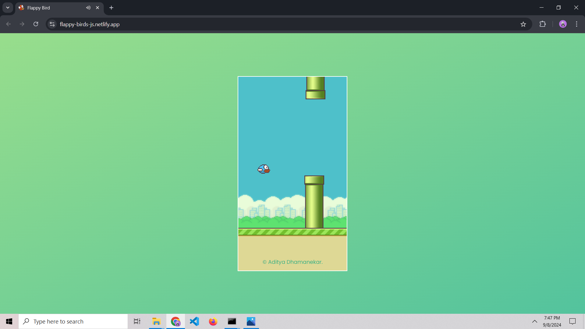

# 🐦 Flappy Bird - JavaScript Edition  
A simple Flappy Bird clone built using **HTML, CSS, and JavaScript**.  
Fly the bird through obstacles and achieve the highest score!  

## 🎮 Live Demo  
[Play Flappy Bird](https://flappy-birds-js.netlify.app/) *(Replace with your actual link)*  

## 📸 Screenshot  
 

## 🛠️ Features  
✔️ Classic Flappy Bird mechanics  
✔️ Responsive and lightweight design  
✔️ Endless gameplay with increasing difficulty  
✔️ Score tracking system  
✔️ Simple, clean JavaScript implementation  
